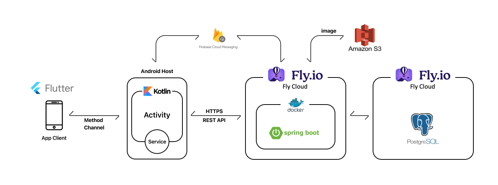

# Eye-To-DO 
# 기능 목차
### 1. 개요
### 2. 강제 데일리 플랜작성
### 3. 데일리 플랜 알람 및 피드백 요청 세분화
### 4. 챌린지 : 장기 계획 관리
# 기능 소개
### 1. 개요
   - MZ 세대 152명 자체 설문조사 결과, 88.8% 플랜 작성 경험 있고, 83% 효과 실감

   - 하지만 이들 중 74%가 더 이상 플랜 작성을 지속하지 않음

   - 그 이유 중 63.2%가 귀찮아서, 깜빡해서-

   - 즉, **"지속의 의지가 하향 곡선을 그리는 것"** 이 가장 근본적인 이유.

   - 이에, **'지속가능한'**, '강력한' 플래너를 만듦.
  
### 2. 강제 플랜 작성
   - 매일 자신이 설정한 **취침시간에 알람**이 울림
     - 다음 날 플랜을 작성해야만 알람 해지

   - **'기상 시간'** 과 **'취침 시간'** 만 선택하면 됨

   - 세부 플랜은 **선택사항**

   - 일단 빠르고 간편하게 시작하게 하여, **유저의 완성 욕구를 자극**하는 UI/UX

   - 이 기능에 대한 **사용자 수요 점수** **4.41**로 매우 높은 편
      
### 3. 플랜 알람 및 피드백 요청 세분화
   - 플랜 시작, 진행, 종료 **총 3단계에 알람** 울림

   - 그 진행 상황 및 이유에 대한 **구체적 객관식 피드백** 요청

   - 해당 데이터 저장하여 프로필에서 **달성률 분석 그래프** 제공
     - 플랜 책임감과 성취감 증진
     - 실천률 증가의 효과를 지님
     - 2023년 8월 11일 경북대학교 48명 대상으로 실험 결과, **잦은 알람 및 피드백을 요청한 팀의 과제 달성률이 60.2%** 더 높았음.
      
### 4. 챌린지 : 장기 계획 관리
   - **장기적인 플랜**을 위한 기능

   - 자신이 설정한 플랜의 달성 여부를 **친구들이 검증**하는 시스템
     - MZ세대의 과시적 성향 활용
     - 기존 돈 걸고 하거나, 말로만 하는 다짐보다 더 경제적이고, 충분한 자극 제공
     - **수요 조사 결과 72%** 사용 의향

   - 챌린지 인증 및 검증 플로우
     1. “’WW’ 동안 ‘XX’ 기간에  ‘YY’를 ‘ZZ’ 번 하기”로 설정
         - 예시 : 한달 동안 일주일에 헬스장 가기 3번
     2. 검증 친구 0~3명까지 설정
     3. XX 기간에 ZZ번 인증 내용 업로드
     4. 챌린지 종료 후 검증 친구가 검증값 입력
     5. 취합해서 달성 여부 결정
     6. 프로필에 달성도 그래프 제공

# 기능에 적용된 기술

### [ 아키텍처 ]
 
  - 앱은 플러터로 (.dart) UI/UX를 통해 클라이언트와 직접적으로 소통하고,
     코틀린은 안드로이드 네이티브 플랫폼으로써 플러터와 서버의 정보 수신 및 발신을 지원한다. 
  - 백엔드는 Fly.io Cloud 위에 Spring Boot와 Postgresql DB를 올려 Android Host에게 데이터를 제공하고 
 이미지 파일은 Amazon S3에 저장하여 관리하고 있는 시스템임

### 왜 Flutter와 Kotlin을 연계하여 썼는가
  - 현재 프론트 팀원 2명의 기술 스택이 Flutter와 Kotlin으로 상이함에 따라 한정된 자원으로 분업을 하여 프로젝트를 진행해야 했음
  - View 개발에 더 편리한 Flutter가 화면을, Kotlin이 device Control 및 HTTP를 통한 서버와 REST API를 통해 통신을 담당하는 것으로 분업하였음
  - 작업 분야를 확실히 나누는 과정에서 확실한 규칙 없이는 개발자 간 소통에 어려움이 있다는 점을 체감함. 이에 따라 두 언어 간 원활한 의사 전달이 이루어지도록 정확하고 간결하게 문서를 작성함.

### 왜 FCM(Firebase Cloud Messaging)을 썼는가
  - 이후에 배포를 위해 ios, 웹까지 확장 될 수 있음을 고려해 특정 플랫폼에 종속되지 않고 Android, ios, web 모두에게 알림 메세지를 보낼수 있는 FCM을 채택하여 푸쉬 알림 시스템을 구현

### 왜 FCM(Firebase Cloud Messaging)을 썼는가
  - DB에 blob 타입으로 직접 이미지를 저장할 수 있지만 성능 저하을 고려하여 DB에는 S3 이미지 객체의 이름과 accessUrl만 저장

## 주요 기능에 대한 설명

### 1. **강제 플랜 작성** ⇒ 앱 백그라운드 상태와 Service를 활용
     
     - Firebase Cloud Messaging 실시간 수신 가능
     - 플랜을 작성하지 않은 상태에서는 앱을 종료해도 작성 화면 재실행
     - 사용자에 의해 설정된 알람을 로컬 DB에 저장 → 시간에 맞춰 알람 화면을 기기에 띄움

### 2. **플랜 알람 및 피드백 요청 세분화**
     - MethodChannel을 이용한 Kotlin과의 통신을 통해 UI와 Thread 분리
     - 알람 실행 시 플랜, 챌린지의 내용을 서버로부터 받아 종류에 맞게 화면 출력
     - 알림 실행 후 사용자의 피드백을 전달받아 반응형으로 화면에 출력

### 3. **챌린지 : 장기 계획 관리**

   **[챌린지 개설시]**

     - 챌린지 개설 시 카카오 메세지API로 특정 유저에게 전송가능
     - 검증자가 챌린지 방에 입장시 FCM으로 실시간으로 챌린지 호스트에게 푸쉬 알림

   **[챌린지 작성]**

     - aws s3를 이용한 챌린지 인증 사진 등록 및 조회
     - 챌린지 등록시 FCM으로 실시간으로 검증자들에게 푸쉬 알림

   **[챌린지 종료]**

     - 챌린지 검증 완료 시 FCM으로 실시간으로 챌린지 호스트에게 푸쉬 알림
